

  <a href="https://vide.pascal-lab.net/">
    <picture>
      <source media="(prefers-color-scheme: dark)" srcset="docs/src/assets/vide-logo-reveal-dark.svg">
      
    </picture>
  </a>

# Vide - 现代 SystemVerilog 开发环境

Vide 是专为 Verilog/SystemVerilog 开发者打造的现代化开发环境，旨在让硬件设计像软件开发一样流畅顺手。Vide 提供了[十多项](https://vide.pascal-lab.net/user-guide/features/)在现代软件开发环境中已成标配、却长期缺失于硬件开发环境的能力，包括但不限于[定义跳转](https://vide.pascal-lab.net/user-guide/features/navigation/)、[代码注解](https://vide.pascal-lab.net/user-guide/features/inlay-hints/)、[精准补全](https://vide.pascal-lab.net/user-guide/features/completion/)和[自动重构](https://vide.pascal-lab.net/user-guide/features/quick-fixes/)等。借助 Vide，硬件开发者可以更高效地理解、编写和维护 Verilog/SystemVerilog 代码。

## 功能展示

### 符号导航

在 Vide 中使用[定义跳转](https://vide.pascal-lab.net/user-guide/features/navigation/)、[引用搜索](https://vide.pascal-lab.net/user-guide/features/references/)和[符号大纲](https://vide.pascal-lab.net/user-guide/features/document-symbols/)在模块、端口和寄存器之间快速定位，让开发者不用离开当前上下文也能追清 RTL 连接关系。

| Peek Definition | Find All References | Document Symbol |
| --- | --- | --- |
| 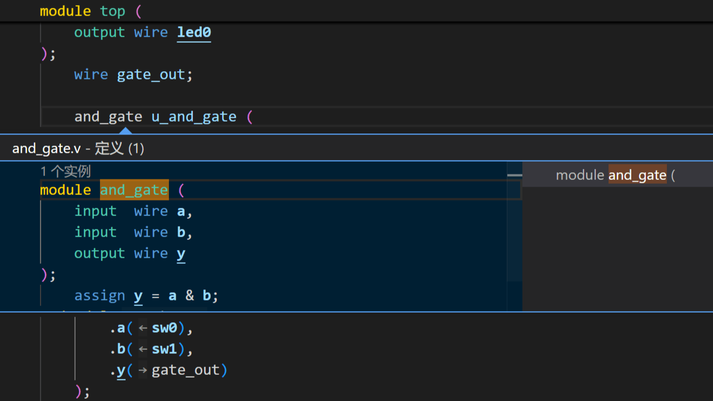 | 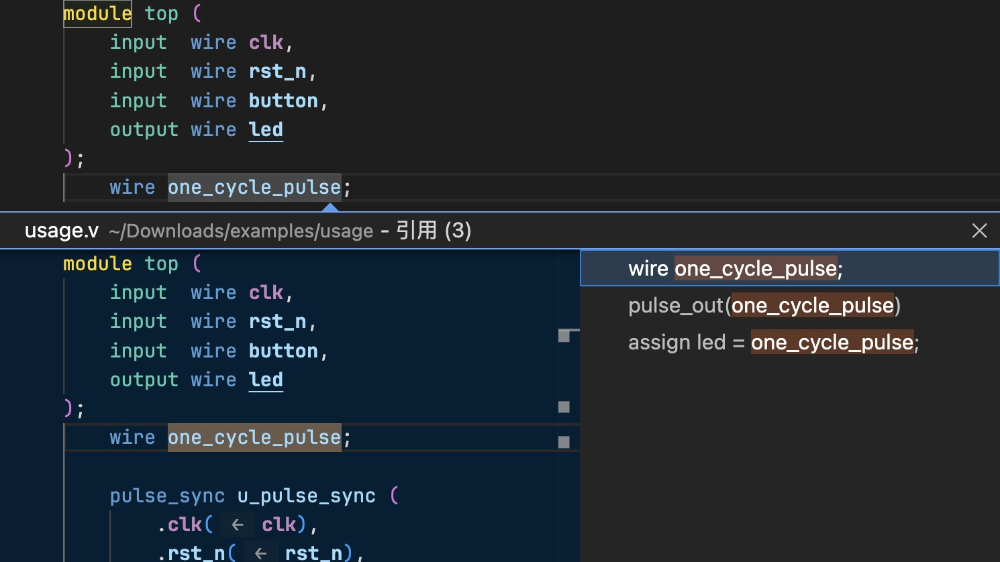 | 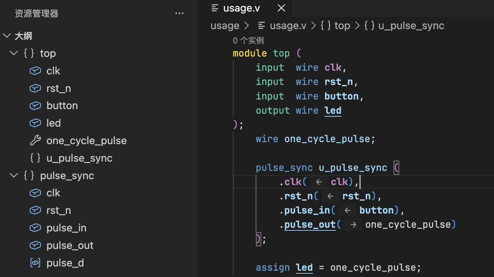 |

### 代码理解

利用 Vide 的[悬停信息](https://vide.pascal-lab.net/user-guide/features/hover/)和[代码注解](https://vide.pascal-lab.net/user-guide/features/inlay-hints/)在一个窗口中实时查看模块、字面量与端口连接信息，减少窗口切换的负担，让开发者更专注于 RTL 设计本身。

|  |  |
| --- | --- |
| 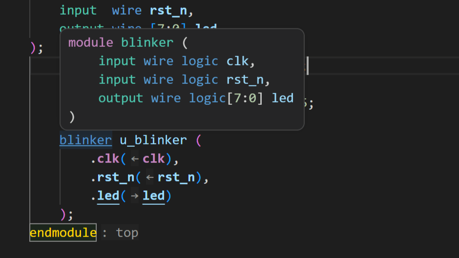 Module Hover | 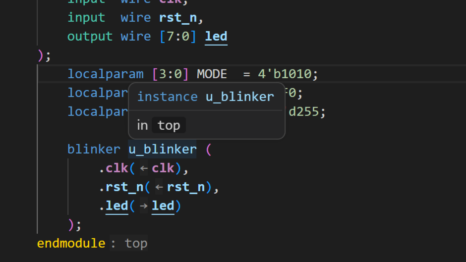 Instance Hover |
| 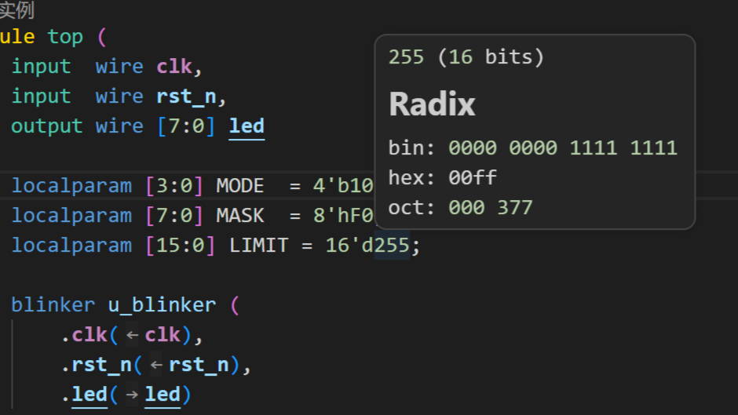 Number Literal Hover | 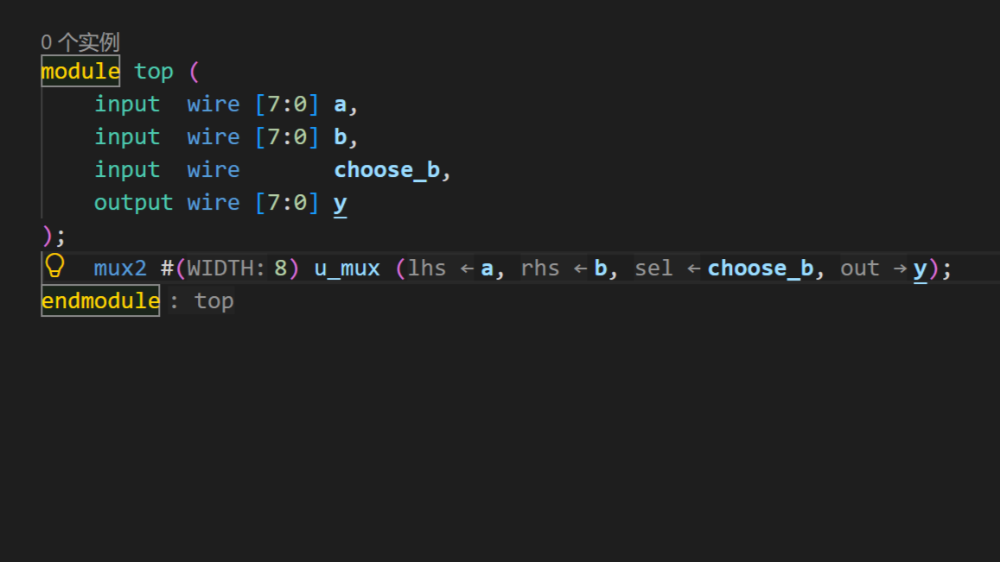 Inlay Hints |

### 精准补全

Vide 的[补全](https://vide.pascal-lab.net/user-guide/features/completion/)机制理解当前代码上下文，能在实例化、端口连接和其他编辑位置给出更贴近工程语义的建议，也能通过代码片段提供结构化补全。

|  |  |  |
| --- | --- | --- |
| 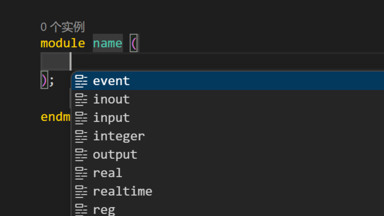 Module Declaration | 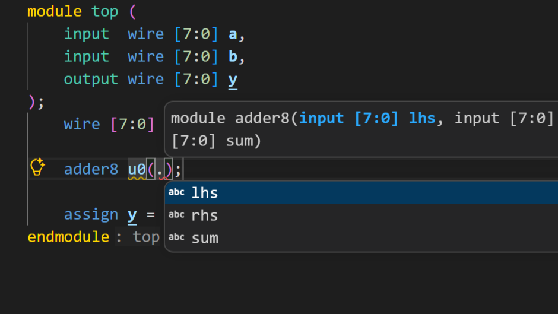 Port Completion | 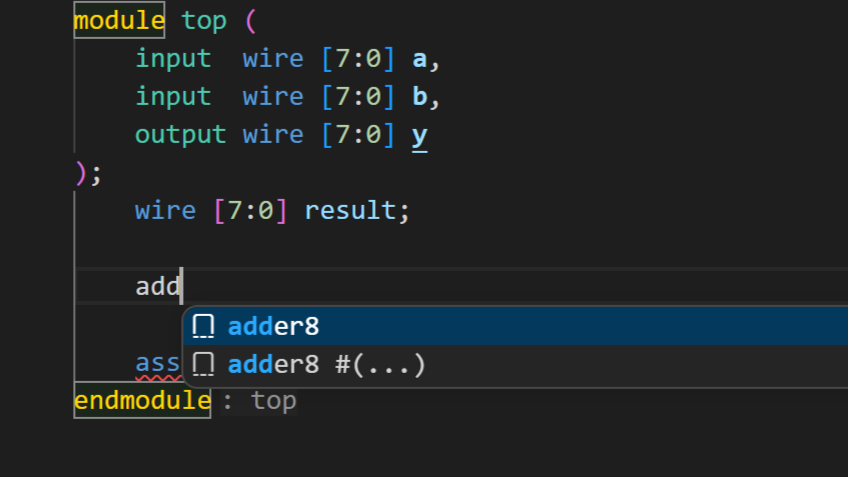 Completion Items |
| 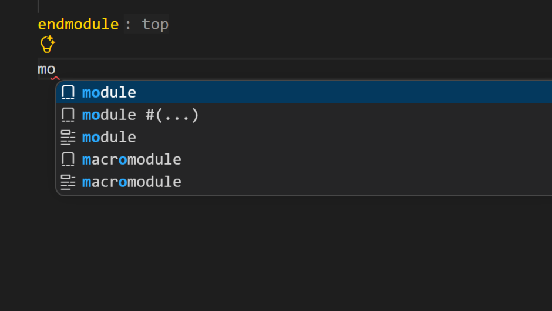 Module Snippet | 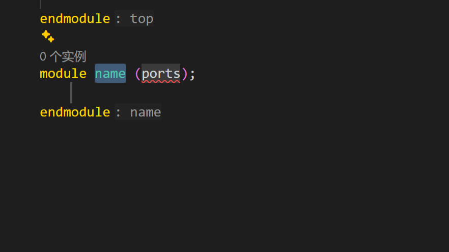 Expanded Snippet |  |

### 自动重构

通过[自动重构](https://vide.pascal-lab.net/user-guide/features/quick-fixes/)和[重命名](https://vide.pascal-lab.net/user-guide/features/rename/)，把端口连线、信号重命名、转换进制这些繁琐的细节交给 Vide 完成，解放开发者的重构体验。

| Missing Ports | Rename |
| --- | --- |
| 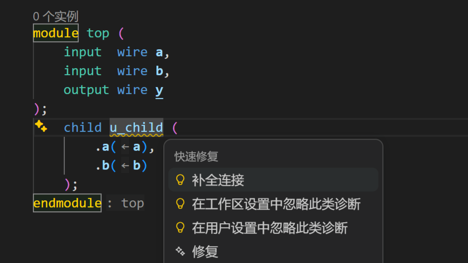 | 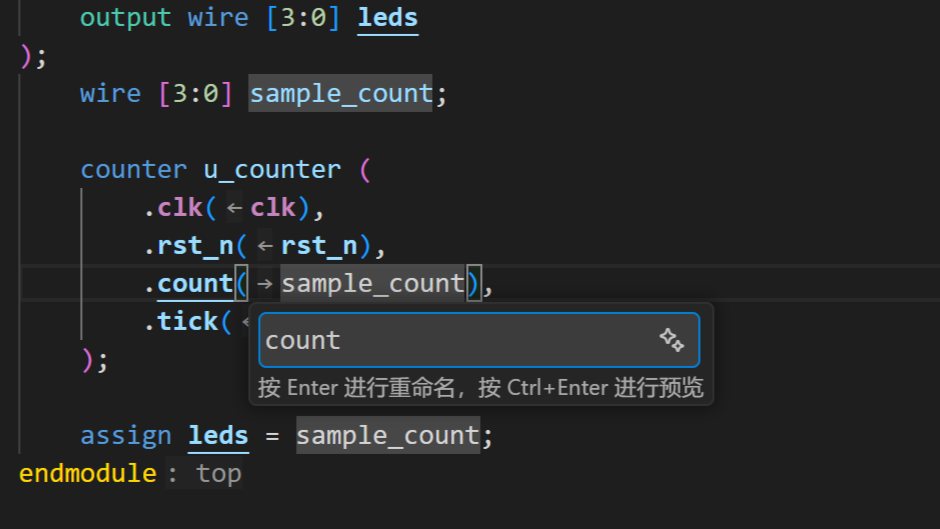 |

### 诊断分析

Vide 能在编辑过程中实时给出[代码诊断](https://vide.pascal-lab.net/user-guide/features/diagnostics/)，让错误更早被发现。此外，Vide 能够结合[骑河（Qihe）](https://vide.pascal-lab.net/user-guide/features/qihe/)提供的静态分析能力，在编辑器中给出更深入的分析结果，帮助开发者发现潜在问题。

| Undeclared Identifier | Loop Analysis |
| --- | --- |
| 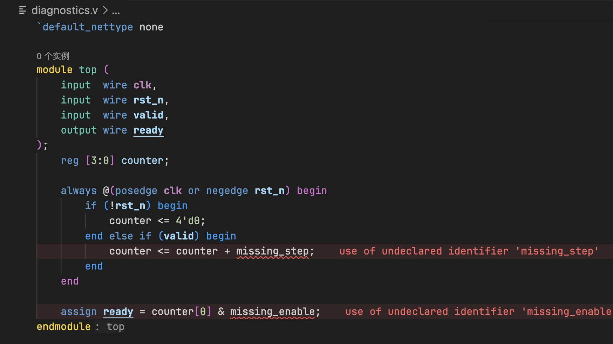 | 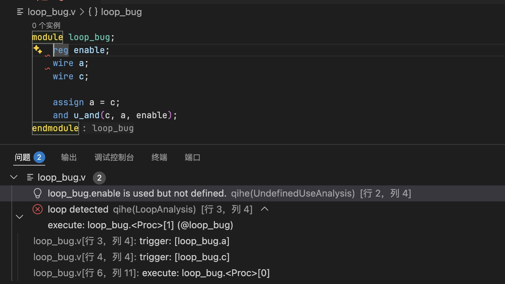 |

## 继续了解 Vide

- [访问官网](https://vide.pascal-lab.net/)：查看完整功能展示、对比信息和文档入口。
- [在线体验](https://vide.pascal-lab.net/playground/)：直接在浏览器中试用 Vide。
- [阅读用户手册](https://vide.pascal-lab.net/user-guide/)：从快速开始、项目配置和功能特性继续了解。

## 许可证

Vide 使用 [MIT License](LICENSE)。
