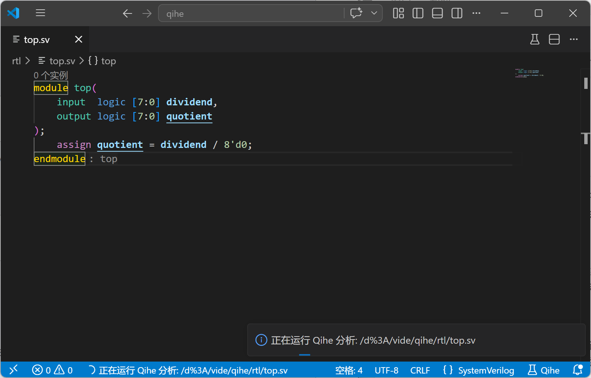
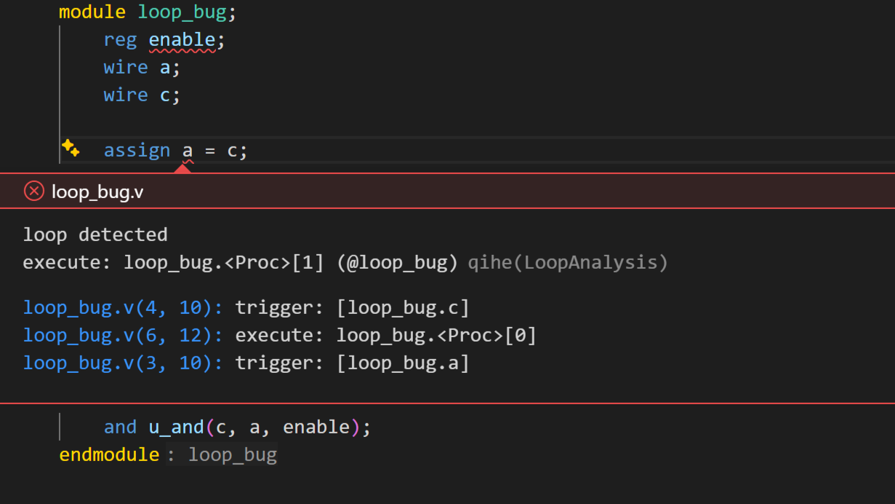

import { FileTree } from '@astrojs/starlight/components';
import Codicon from '../../../../../components/Codicon.astro';
import ThinLinkCard from '../../../../../components/ThinLinkCard.astro';

## What Qihe Is

Qihe is a general-purpose Verilog static analysis framework from the PASCAL research group behind Vide. It includes a set of deep hardware analysis capabilities that can be used out of the box.

Qihe and Vide are complementary. Vide focuses on fast, immediate static-analysis feedback during hardware development, so it is not the right place for deeper and more expensive tasks such as hardware vulnerability mining. Qihe focuses on deep static analysis for non-realtime workflows.

Vide can call the Qihe command-line tool from `vide.toml`, run Qihe analysis for the whole project, and show Qihe diagnostics in the editor. Together, Vide and Qihe provide both immediate feedback and deeper analysis results inside the same VS Code workflow.

## Get Qihe

Before using Qihe from Vide, register on the [Qihe project site](https://qihe.pascal-lab.net/), get the Qihe source code, then follow the [Qihe CLI getting started guide](https://qihe-docs.pascal-lab.net/platform-cli/getting-started.html) to install the `qihe` command-line tool and add it to `PATH`.

<ThinLinkCard
  href="https://qihe.pascal-lab.net/"
  title="Qihe Project Site"
  action="Open"
>
  Get Qihe source code and project information.
</ThinLinkCard>

<ThinLinkCard
  href="https://qihe-docs.pascal-lab.net/platform-cli/getting-started.html"
  title="Qihe CLI Getting Started"
  action="Open"
>
  Install the local <code>qihe</code> command-line tool.
</ThinLinkCard>

## Run Qihe

Vide currently supports running Qihe on the whole project or on the current file.

### Analyze a Project

Project analysis needs `vide.toml` to describe source files, include directories, macro definitions, and top modules. See [Configure the First Project](../../first-project/) and [Project Configuration Reference](../../project-configuration/) for the setup.

A single-file project can be organized like this:

<FileTree>
- my-qihe-demo/
  - vide.toml
  - rtl/
    - top.sv
</FileTree>

Write `vide.toml` as:

```toml
#:schema https://vide.pascal-lab.net/schemas/v1/vide.schema.json
sources = ["rtl/top.sv"]
top_modules = ["top"]
```

Write `rtl/top.sv` as:

```verilog
module top(
    input  logic [7:0] dividend,
    output logic [7:0] quotient
);
    assign quotient = dividend / 8'd0;
endmodule
```

This code intentionally keeps a divide-by-zero expression. After Qihe runs, the editor shows a diagnostic from `ZeroDivisionAnalysis`.

Run it:

1. Open `my-qihe-demo/` in VS Code.
2. Open `rtl/top.sv`.
3. Click the <Codicon name="beaker" label="Run Qihe Analysis icon" /> beaker icon in the editor title bar, or run `Vide: Run Qihe Analysis` from the Command Palette.
4. After the run finishes, Qihe diagnostics appear in the editor and the Problems panel. To inspect commands and raw output, open the `Vide Qihe` output channel.



_Analyzing: the Qihe status item shows the current target file and run progress._



_Analysis result: diagnostics and Qihe output details help locate the issue._

### Analyze One File

If the workspace has no `vide.toml`, `Vide: Run Qihe Analysis` sends the currently open Verilog/SystemVerilog file to Qihe.

If `vide.toml` is still the default empty template and no project source files are resolved, the run is also a single-file analysis. This is mainly for quick trials and demos; real projects should configure `vide.toml` so include directories, macro definitions, and top modules are passed to Qihe.

## How Commands Are Built

For project analysis, Vide reads `vide.toml` and builds the Qihe compile input. With the default settings, the command shape is:

```bash
qihe compile <qihe-compile-args> --mode sv <project-files> -o <tmp.qh> -- <forwarded-slang-args> --top <top-module> -I <include-dir> -D<macro>
qihe run <qihe-run-args> -i <tmp.qh> -c storage.root=<tmp-storage>
```

The arguments come from:

- `<project-files>` comes from project input files resolved from `sources` and `libraries`.
- `--top <top-module>` comes from `top_modules`.
- `-I <include-dir>` comes from `include_dirs`.
- `-D<macro>` comes from `defines`.
- `<qihe-compile-args>` comes from the part of `vide.qihe.compileArgs` before `--`.
- `<forwarded-slang-args>` comes from the part of `vide.qihe.compileArgs` after `--`.
- `<qihe-run-args>` comes from `vide.qihe.runArgs`.
- `<tmp.qh>` and `<tmp-storage>` are temporary paths created by Vide for the run.

If `vide.qihe.compileArgs` already contains `--mode`, `--mode=...`, or `-m ...`, Vide does not add `--mode sv` again.

Common defaults are:

```json
{
  "vide.qihe.command": "qihe",
  "vide.qihe.autoConfigureArgsFromManifest": true,
  "vide.qihe.compileArgs": [],
  "vide.qihe.runArgs": ["-g", "std"]
}
```

See [Qihe settings](../../vscode-settings/#qihe).

Vide then parses Qihe diagnostics and shows them in the editor. The command execution details are available in VS Code's Output panel: choose the `Vide Qihe` output channel.

If you do not want Vide to generate `--mode sv`, `--top`, `-I`, and `-D` from `vide.toml`, set `vide.qihe.autoConfigureArgsFromManifest` to `false` in VS Code Settings. After that, input files still come from the current project or the current file, and the command shape becomes:

```bash
qihe compile <qihe-compile-args> <input-files> -o <tmp.qh> [-- <forwarded-slang-args>]
qihe run <qihe-run-args> -i <tmp.qh> -c storage.root=<tmp-storage>
```

`<input-files>` means the Verilog/SystemVerilog input files passed to `qihe compile`. In project mode, they come from files resolved from `sources` and `libraries`; in single-file mode, it is the currently open file.

For example:

```json
{
  "vide.qihe.autoConfigureArgsFromManifest": false,
  "vide.qihe.compileArgs": ["--mode", "sv", "--", "-I", "include"],
  "vide.qihe.runArgs": ["-g", "std"]
}
```

If you need to adjust Qihe arguments further, first decide whether the arguments belong to `qihe compile` or `qihe run`. The command arguments are documented here:

<ThinLinkCard
  href="https://qihe-docs.pascal-lab.net/platform-cli/compile.html"
  title="qihe compile Arguments"
  action="Open"
>
  Read the command-line arguments for <code>qihe compile</code>.
</ThinLinkCard>

<ThinLinkCard
  href="https://qihe-docs.pascal-lab.net/platform-cli/run.html"
  title="qihe run Arguments"
  action="Open"
>
  Read the command-line arguments for <code>qihe run</code>.
</ThinLinkCard>

## Failures and Errors

If Qihe analysis fails, open the `Vide Qihe` output channel first and check:

1. Whether the target is a local saved `.v`, `.vh`, `.sv`, `.svh`, or `.svi` file.
2. Whether the `qihe compile` command and compile arguments match the project.
3. Whether the `qihe run` command and run arguments match the analysis target.
4. Whether Qihe stdout or stderr contains a direct compile or run error.
5. The final failure message at the end of the output.

If the error is related to include paths, macro definitions, or top modules, fix [Project Configuration](../../project-configuration/) first.

If the error is related to the Qihe command path, first set `vide.qihe.command` to the absolute path of the `qihe` executable. On Windows, if the default shell resolves the batch entry point, set it to the absolute path of `qihe.bat`.

If the problem comes from Qihe's own compile or run process, file an issue in the [Qihe project](https://qihe.pascal-lab.net/).
