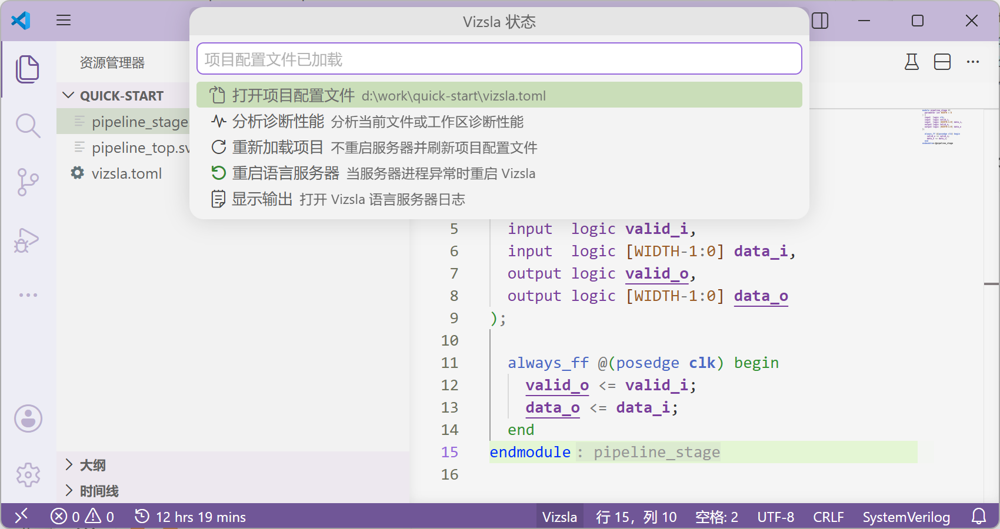

import VideLab from '../../../../components/VideLab.astro';
import ThinLinkCard from '../../../../components/ThinLinkCard.astro';

export const quickStartFiles = [
  {
    path: "vide.toml",
    languageId: "toml",
    editable: false,
    source: `sources = ["rtl/**"]\n`,
  },
  {
    path: "rtl/quick_delay.sv",
    source: `module quick_delay #(
  parameter int STAGES = 2
) (
  input  logic clk,
  input  logic rst_n,
  input  logic valid_i,
  output logic valid_o
);
  logic [STAGES-1:0] pipe;

  always_ff @(posedge clk or negedge rst_n) begin
    if (!rst_n) begin
      pipe <= '0;
    end else begin
      pipe <= {pipe[STAGES-2:0], valid_i};
    end
  end

  assign valid_o = pipe[STAGES-1];
endmodule
`,
  },
  {
    path: "rtl/quick_start_top.sv",
    source: `module quick_start_top (
  input  logic clk,
  input  logic rst_n,
  input  logic start,
  output logic done
);
  logic valid_q;

  quick_delay #(
    .STAGES(2)
  ) u_delay (
    .clk(clk),
    .rst_n(rst_n),
    .valid_i(start),
    .valid_o(valid_q)
  )

  assign done = valid_q;
endmodule
`,
  },
];

Follow these steps to confirm that Vide works in VS Code.

## 1. Install the Extension

For daily use, install the stable Marketplace extension. After installation, open your RTL project directory; the extension automatically uses the bundled `vide` language server, so you do not need to configure a server path.

<ThinLinkCard
  href="https://marketplace.visualstudio.com/items?itemName=vizsla.vizsla-lsp"
  title="Visual Studio Marketplace"
  action="Open"
>
  Install stable Vide, extension ID: <code>vizsla.vizsla-lsp</code>
</ThinLinkCard>

You can also search for the display name `Vide` or the extension ID `vizsla.vizsla-lsp` in the VS Code Extensions view.


## 2. Open a Project Directory

Open the directory that contains your RTL source code in VS Code. This directory is the workspace root: the top-level folder you opened in VS Code.

If this directory contains Verilog/SystemVerilog source files but has no `vide.toml`, the extension prompts you to create a default project manifest. After you choose to create it, the extension writes a conservative `vide.toml` and reloads Vide.


The default configuration sets `sources = []`, which means Vide does not scan the whole project automatically. You can leave it unchanged while trying syntax highlighting, single-file error reporting, the status bar, and commands. To tell Vide where your RTL files are, add the source directory to `sources`, for example:

```toml
sources = ["rtl/**"]
```

For the full default template and the difference between `sources = []` and omitted `sources`, see [First Project](../first-project/).

## 3. Check the Status Bar

After the extension activates, the right side of the VS Code status bar shows a status item named `Vide`. The item usually displays `Vide`; it shows a spinner while starting or stopping, a warning icon when the project manifest is missing, and an error icon when startup or project configuration fails. Hover over the status item to see the current details.


Click the status item to open the status menu. Common entries include `Open Manifest`, `Create Manifest`, `Reload Project`, `Restart Language Server`, `Profile Diagnostics`, and `Show Output`.



## 4. Open a Verilog/SystemVerilog File

Open a Verilog `.v`/`.vh` file or a SystemVerilog `.sv`/`.svh`/`.svi` file. VS Code should recognize the matching language and enable syntax highlighting and language services.


If nothing happens after installation, first check that the opened folder contains `.v`, `.vh`, `.sv`, `.svh`, or `.svi` files and that you have opened an RTL file. If the `Vide` status item does not appear, reload the VS Code window. If the status item shows an error or you need output logs, start with the status bar section above. Use [Advanced Installation](../../advanced-guide/advanced-installation/) and [Server Self-Check](../../advanced-guide/check-server/) when you need VSIX packages, a custom server, or startup logs.

## 5. Try the Core Features

You can verify features in this order:

1. Write an obvious syntax error and check diagnostics, meaning errors, warnings, and hints, in the `Problems` panel.
2. Run `Go to Definition` or `Go to Declaration` on a module name, signal name, or instance name.
3. Trigger completion inside instance port connections, parameter assignments, expressions, or preprocessor positions.
4. Hover over a symbol to view its information.

<VideLab
  projectId="quick-start"
  projectLabel="Quick Start"
  entryFile="rtl/quick_start_top.sv"
  files={quickStartFiles}
  load="visible"
  activeFile="rtl/quick_start_top.sv"
  selection="16:3-16:4"
  diagnosticsOpen
  title="Start with a small mistake"
  description="This quick-start project starts with one missing semicolon. Check the diagnostics, fix the instance ending to `);`, then try hover, completion, and navigation."
/>

If VS Code prompts you to restart Vide after changing server launch settings, choose `Restart`.
