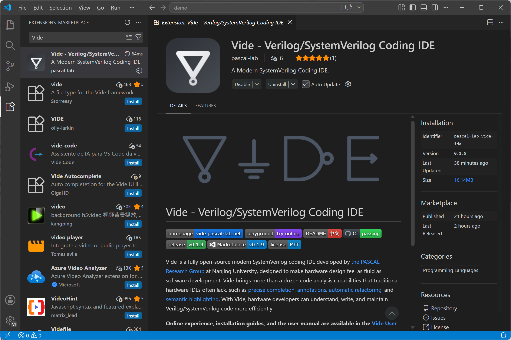
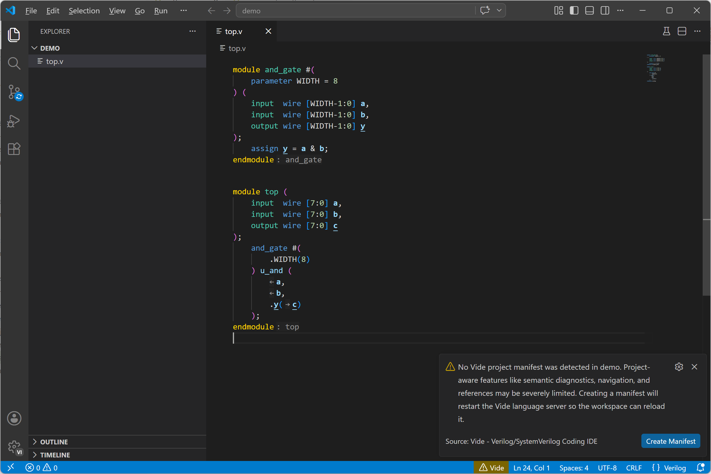
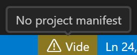
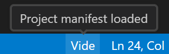
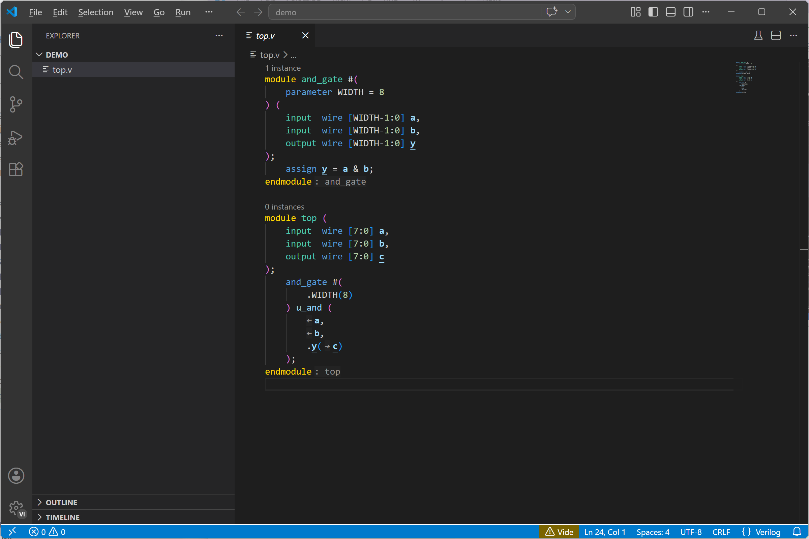

import ThinLinkCard from '../../../../components/ThinLinkCard.astro';

This page walks you through installing the Vide VS Code extension and verifying that Vide is working correctly. If you have not installed VS Code yet, download it from the [VS Code website](https://code.visualstudio.com/).

## 1. Install the Extension

For regular use, simply install the stable version published on the VS Code Marketplace. The card below links to the Marketplace:

<ThinLinkCard
  href="https://marketplace.visualstudio.com/items?itemName=pascal-lab.vide-ide"
  title="Visual Studio Marketplace"
  action="Open"
>
  Install stable Vide, extension ID: <code>pascal-lab.vide-ide</code>
</ThinLinkCard>

You can also search for the display name `Vide` or the extension ID `pascal-lab.vide-ide` in the VS Code Extensions view.

## 2. Open an RTL Project Directory

Open the project folder that contains your RTL source code in VS Code.

If the project contains Verilog/SystemVerilog source files but has no project configuration file named `vide.toml`, the extension prompts you to create a default configuration. For exploration, you can skip this step for now, because Vide can still provide some analysis without a configuration.

We will create the first `vide.toml` in [Configure the First Project](../first-project/).

## 3. Confirm Vide Started

After the extension activates, a status item named `Vide` appears in the VS Code status bar. When startup is normal, the item displays `Vide`. The status bar may appear yellow at this point because no `vide.toml` configuration file has been created yet.

If `vide.toml` is properly configured, hovering over the status item shows the status details as pictured below.

Both states indicate that Vide has started and you can continue exploring.

:::note
If the `Vide` status item does not appear, reload VS Code and open the project folder. If it still does not appear after restarting, please [contact us](https://github.com/pascal-lab/vide/issues/new).
:::

## 4. Open an RTL File

Open a Verilog `.v`/`.vh` file or a SystemVerilog `.sv`/`.svh`/`.svi` file. VS Code can recognize the language and enable syntax highlighting and Vide analysis.

## Next Step

After installation is verified, use [Configure the First Project](../first-project/) to write your first `vide.toml`, then read [Features](../features/) to learn about the editing capabilities.
