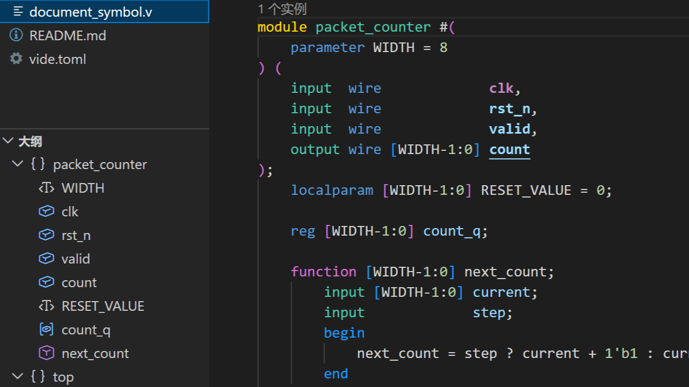

import FeatureExample from '../../../../components/FeatureExample.astro';
import VideLab from '../../../../components/VideLab.astro';
import inlayHintsGif from '../../assets/features/inlay-hints.gif';
import { structureFiles } from '../../../../examples/dailyUse';

结构辅助的目标是让 RTL 阅读更少依赖来回跳转：

- 端口连接行内提示：在实例连接旁显示目标端口名。
- 参数赋值行内提示：在参数列表里显示目标参数名。
- 结构结尾行内提示：在 `endmodule` 等结尾处显示对应结构名。
- 语义高亮：在主题支持时区分端口方向、时钟复位和读写位置。
- 实例数量提示：在模块声明上方显示被实例化次数。
- 大纲、折叠和扩大/缩小选择：帮助浏览文件结构。

相关设置参考：[Inlay Hints](../../../advanced-guide/vscode-settings/#inlay-hints)、[Lens](../../../advanced-guide/vscode-settings/#lens)、[Semantic Tokens](../../../advanced-guide/vscode-settings/#semantic-tokens)。

<FeatureExample
  image={inlayHintsGif}
  imageAlt="VS Code 中显示实例端口行内提示的动图"
  imageCaption="VS Code 中的行内提示"
  labCaption="示例复现同一个 mux demo"
>
  <VideLab
    projectId="daily-structure"
    projectLabel="Features: Structure"
    entryFile="inlay_hints.v"
    files={structureFiles}
    height="100%"
    initialActiveFile="inlay_hints.v"
    initialSelection="18:5-23:6"
    title="实例端口行内提示"
    description="这个示例使用 mux2/top demo，展示端口连接行内提示如何来自目标模块解析。"
  />
</FeatureExample>

## 大纲、折叠和语义选区

大纲和面包屑来自 VS Code 的符号视图，适合快速定位 module、interface、function/task、generate block 和声明。折叠由语言服务器按语法结构提供，能折叠模块体、块语句、声明列表等区域。

_大纲会把 RTL 文件里的模块、参数、端口、声明和函数按层级展示。_

扩大/缩小选择使用 VS Code 的 `Expand Selection` / `Shrink Selection` 命令。Vide 会按语法节点扩大选区，比纯文本扩大更适合选中端口列表、表达式、实例或整个结构。

## 调整显示

在 VS Code 设置里搜索 `Vide inlay hints`，按类型开关端口连接、参数赋值和结构结尾提示。语义高亮还依赖当前主题是否为这些 token 提供样式。

:::note[项目范围]
端口/参数提示和实例数量提示依赖目标模块解析。只打开单个文件，或 `sources = []` 时，这些结果会按当前可见的项目视图计算；把相关源文件写入 `sources` 后，执行 `Vide：重新加载项目配置`。
:::
