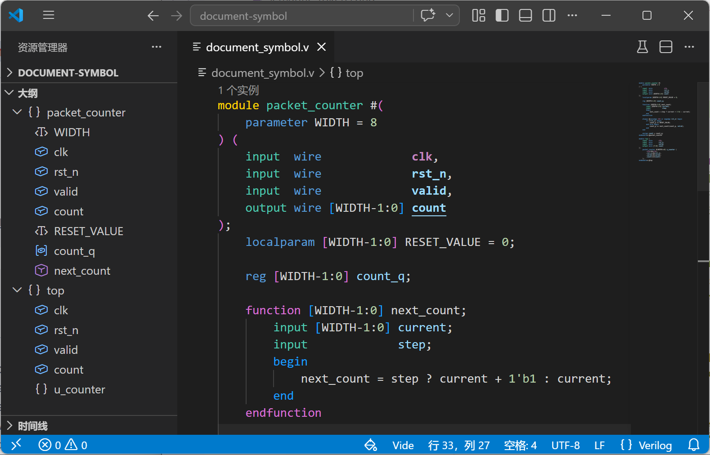

import Codicon from '../../../../components/Codicon.astro';
import FeatureExample from '../../../../components/FeatureExample.astro';
import VideLab from '../../../../components/VideLab.astro';
import documentSymbolsImage from '../../assets/features/document-symbols.png';
import { documentSymbolFiles } from '../../../../examples/dailyUse';

## 什么是符号大纲

符号大纲把当前文件里的模块、端口、参数、声明、函数、任务、generate 块和区域结构整理成层级。它会出现在 VS Code 的 <Codicon name="list-tree" label="Outline 图标" /> Outline 面板、面包屑 <Codicon name="chevron-right" label="面包屑层级图标" /> 和 <Codicon name="symbol-misc" label="符号图标" /> `转到文件中的符号` 等入口里。

## 演示

## 项目配置影响

### 没有完整配置时

符号大纲主要来自当前文件结构，因此打开单个文件就能使用。

### 有完整配置时

写好 `vide.toml` 后，include 文件和宏分支会按工程配置解析，大纲也会更接近真实工程里看到的结构。

## 实例数量提示

Vide 还可以在模块声明上方显示该模块被实例化的次数。这个实例数量注解属于 [代码注解](../annotations/)，由 `vide.lens.instantiations.enable` 控制；完整参考见 [Lens 设置](../../vscode-settings/#lens)。
