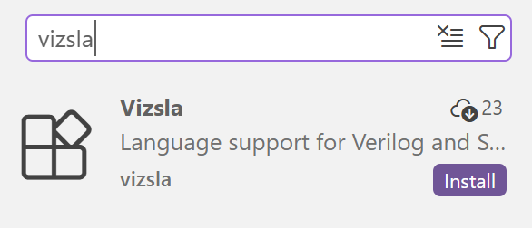
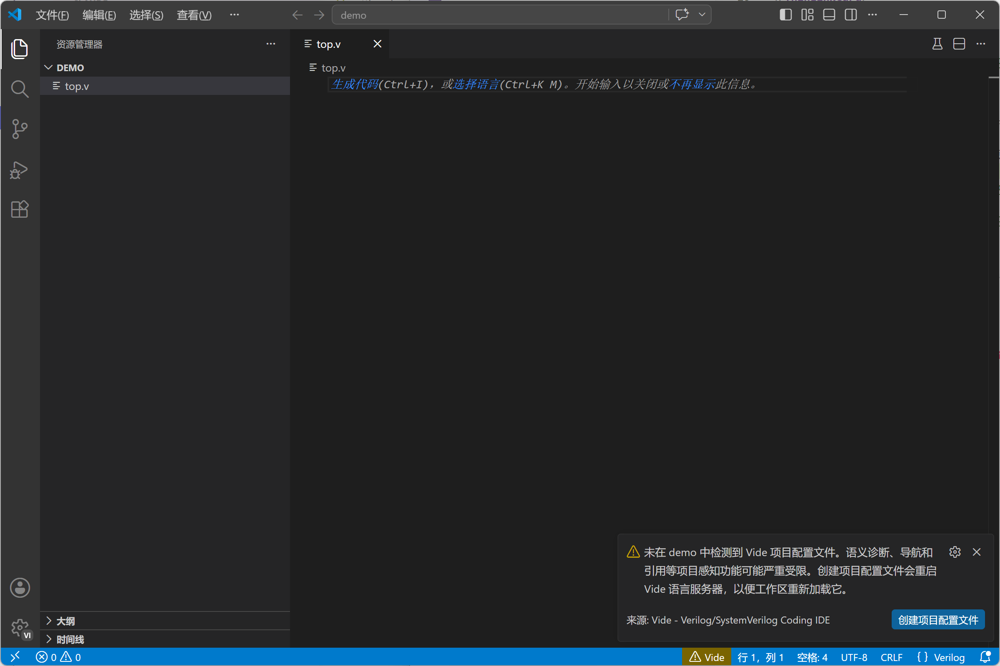
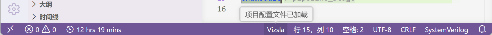
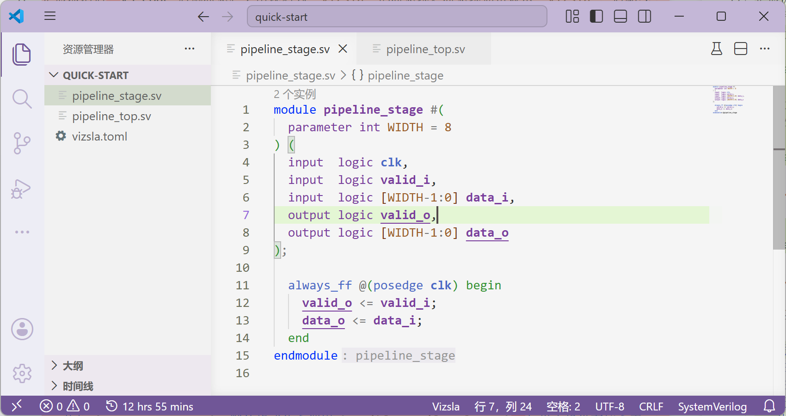

import ThinLinkCard from '../../../components/ThinLinkCard.astro';

这一页带你安装并验证 Vide 正在正确工作。

## 1. 安装扩展

常规使用只需要安装 Marketplace 稳定版。以下卡片可以跳转到 VS Code 扩展市场：

<ThinLinkCard
  href="https://marketplace.visualstudio.com/items?itemName=pascal-lab.vide"
  title="Visual Studio Marketplace"
  action="打开"
>
  安装稳定版 Vide，扩展 ID：<code>pascal-lab.vide</code>
</ThinLinkCard>

也可以在 VS Code 的扩展面板搜索显示名 `Vide`，或搜索扩展 ID `pascal-lab.vide`。

## 2. 打开 RTL 工程目录

用 VS Code 打开包含 RTL 源码的项目文件夹。

如果项目里有 Verilog/SystemVerilog 源文件，但没有项目配置文件 `vide.toml`，扩展会提示你创建默认配置。体验时，你暂时可以跳过这一步，因为 Vide 对于没有配置的项目仍能提供一定的分析。

我们会在 [配置第一个项目](../first-project/) 里带你创建第一份 `vide.toml`。

## 3. 确认 Vide 已启动

扩展激活后，VS Code 右侧状态栏会出现名为 `Vide` 的状态项。正常启动后状态项显示 `Vide`。把鼠标悬停在状态项上，看到当前状态详情，即说明 Vide 已启动。

:::note
如果没有显示 `Vide` 状态，请重新启动 VS Code 并打开项目文件夹。如果重启后仍然没有显示，请与我们 [联系](https://github.com/pascal-lab/vide/issues/new)。
:::

## 4. 打开 RTL 文件

打开 Verilog `.v`/`.vh` 文件，或 SystemVerilog `.sv`/`.svh`/`.svi` 文件。VS Code 可以识别并启用语法高亮和 Vide 的分析。

## 下一步

安装验证完成后，先用 [配置第一个项目](../first-project/) 写出第一份 `vide.toml`，再进入 [功能特性](../features/) 了解各项编辑能力。
