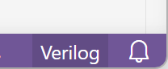
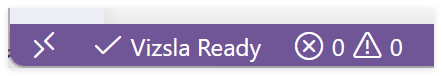

# 快速上手

## 从扩展市场安装扩展

在 VS Code 扩展面板中搜索 `Vizsla LSP`，点击安装。

等待安装完毕后，打开 VS Code 命令面板，输入 `Vizsla`。能看到 `Vizsla: Show Language Server Output`、`Vizsla: Restart Language Server`、`Vizsla: Show Server Version`，说明扩展已经安装。

## 新建文件

在 VS Code 中新建一个以 `.v` 或 `.sv` 为后缀的文件，在窗口的右下角，你会看到 Verilog / System Verilog 语言已经被 VS Code 识别。



在 VS Code 窗口的左下角，你可以看到 Vizsla 的状态栏。



看到 `Vizsla Ready`，说明此时 Vizsla 已经启动并正常运行，可以开始使用。

> [!TIP]
> 如果看到 `Vizsla Error`，点击状态栏即可打开输出日志。

试着在文件中手动输入以下内容：

```verilog
module buggy;
    reg b;
    wire a, c;
    assign a = c;
    and and1(c, a, b);
endmodule
```

## 试一个功能

在模块实例化的端口列表里输入 `.`：

```systemverilog
child u_child(
    .
);
```

如果工程能被解析，你应该看到端口补全。也可以试试 `F12` 跳转定义、`Shift+F12` 查找引用、`F2` 重命名。

## 5. 工程复杂时再写配置

如果 include、宏、第三方库识别不对，在工程根目录创建 `vizsla_config.toml`：

```toml
top_modules = ["top"]
sources = ["rtl"]
include_dirs = ["include", "rtl"]
libraries = ["ip/vendor"]
defines = ["SYNTHESIS"]
exclude = ["build", "sim/out"]
```

保存后 Vizsla 会自动刷新。如果没有刷新，运行：

```text
Vizsla: Restart Language Server
```

想看完整解释，请阅读 [安装方式：扩展市场或源码构建](./installation.md)。

